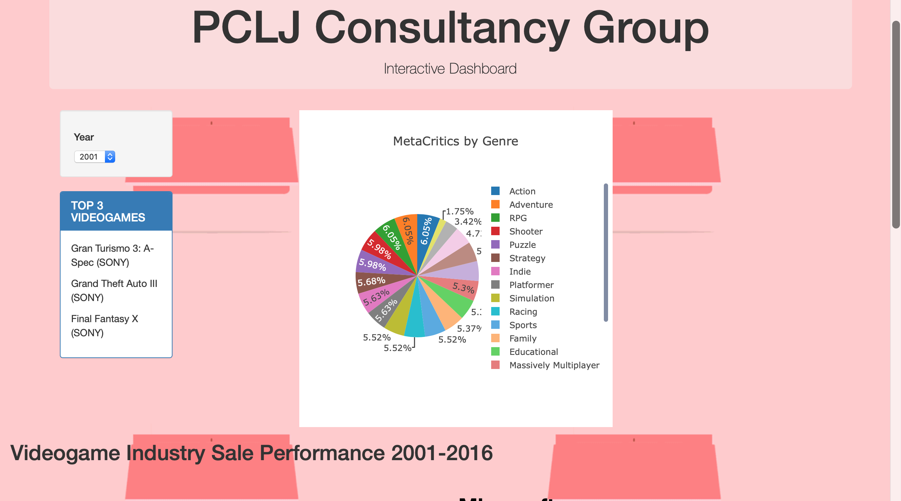

# Videogames

     

## Introduction

This project was created with the intention of answering certain questions about video games.

Assuming that we are a consultancy company which has been asked to advise a new video game producer BestVGS Cia. Ltd. which specializes in making a videogame. They have been proposed to associate with one of these amazing Brands: They want to enquire the following questions:

- Which company should they associate playstation vs xbox nintendo csv metrics json
- Relations between genre and console
- which región they should launch their new platform
- Review the videogame competition and créate strategy Database from the video games console from the last 15 years. 

## Tools and languajes

The following tools were used to developed the web page
+ Python
  + Flask
  + os
  + pymongo
+ MongoDB
+ PostgreSQL
+ Javascript
  + Jquery
  + Plotly
  + D3
+ HTML
+ CSS

This dashboard contain information about: 

- Top 3 games per year
- Critics by genres
- Line chart that show the global sales per company

Nintendo, Sony and Microsoft are the companies that were taken to make this dashboard. The data was provided by [Rapid API](https://rapidapi.com/marketplace "API") from one of the APIS that contains a lot of information of videogames in the last years.

Here you can see the dashboard
[Videogames Dashboard](https://pclj-videogames.herokuapp.com "PCLJ Consultancy Group")

## Screenshots

